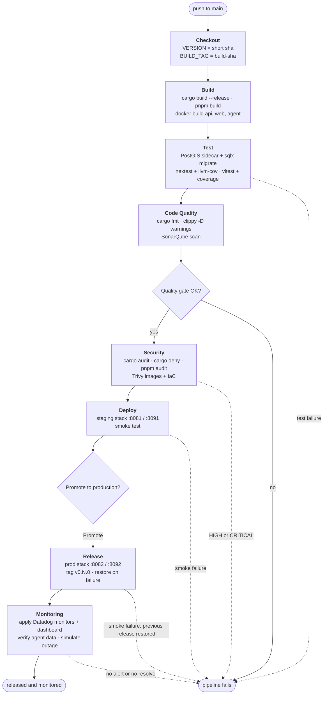

# Aboriginal Art Gallery

Backend service (with a thin Vue web client) for the curatorial catalogue of
an **Aboriginal art gallery of Australia** - University Practical Task 5.2
(HD). It records artists, the artifacts they produced, and the tribes /
language groups they belong to, including each tribe's traditional **Country**
as real PostGIS geographic data, with all curatorial edits gated behind
authenticated, role-restricted access while the catalogue stays publicly
readable.

> We acknowledge the Traditional Custodians of the lands across Australia and
> pay our respects to Elders past and present. Territory polygons in this
> project are coarse demo approximations, **not** authoritative cultural
> boundaries.

## Stack

| Layer | Choice | Notable for the brief |
|---|---|---|
| Web API | **Rust + Axum 0.8** | Non-ASP.NET stack |
| Data access | **sqlx 0.8** - compile-time-checked SQL | Not an ORM; queries verified against the schema at build time (live DB or the committed `.sqlx/` cache) |
| Database | **PostgreSQL 16 + PostGIS 3.4** | CITEXT, GiST, functional index, CHECKs, triggers, spatial queries |
| Auth | **Argon2id + HS256 JWT**, typed role extractors | Auth approach not covered by the unit |
| Frontend | **Vue 3 + Vite + Pinia + Tailwind v4** | Added front-end |
| API docs | **OpenAPI / Swagger UI** + rustdoc | Custom + generated documentation |
| Types | **openapi-typescript** | Frontend types generated from the spec - cannot drift |
| Testing | **`sqlx::test`** ephemeral DBs + HTTP-level tests | Testing framework |

## Bounded contexts

Four (the brief allows 3-5): **Artists**, **Artifacts**, **Tribes** (subsumes
*Maps* - territory + spatial search), **Users & Access** (subsumes
*Membership and Roles* - JWT auth + `User`/`Admin`). Rationale in
[`docs/brd.md`](./docs/brd.md).

## Quick start

Prereqs: Docker, Rust toolchain + [`sqlx-cli`](https://crates.io/crates/sqlx-cli)
(`cargo install sqlx-cli --no-default-features --features native-tls,postgres`),
Node + `pnpm` (or `npm`).

```bash
# 1. Start Postgres + PostGIS
docker compose up -d db

# 2. Apply migrations. sqlx checks queries at compile time against DATABASE_URL.
#    Builds without a database use the committed .sqlx/ cache: SQLX_OFFLINE=true.
#    After changing a query, refresh the cache: cargo sqlx prepare -- --all-targets
cd api
sqlx migrate run

# 3. Seed curated data (tribes + territory polygons, artists, artifacts, admin)
cargo run --bin seed          # prints: admin@gallery.local / admin-demo-pw

# 4. Start the API (http://localhost:8080)
cargo run --bin gallery-api

# 5. In another shell - regenerate FE types from the live spec, then run Vite
cd web
pnpm install
pnpm run generate:types       # reads /api-docs/openapi.json -> src/api/generated.ts
pnpm run dev                  # http://localhost:5173
```

- Swagger UI: <http://localhost:8080/docs> · OpenAPI JSON:
  `/api-docs/openapi.json`
- Sign in (web or Swagger "Authorize") with the seeded admin to see
  curatorial CRUD and the admin **Users** page.

## Common commands

```bash
cd api && cargo test                 # full integration suite (ephemeral DBs)
cd api && cargo test --test auth      # one file (auth | territory | …)
cd api && cargo ci-test               # nextest + coverage, JUnit and lcov like CI
cd web && pnpm test                   # vitest in watch mode
cd api && cargo doc --no-deps         # rustdoc site -> target/doc/gallery_api/
docker compose down -v                # wipe the DB volume (fresh start)
```

## Project structure

```
api/                Rust backend (Axum + sqlx)
  src/<context>/    model.rs · store.rs · routes.rs · mod.rs  (one shape per BC)
  src/auth/         JWT, Argon2id, AuthUser/AdminUser extractors
  src/error.rs      single AppError -> HTTP funnel
  src/openapi.rs    OpenAPI document assembly
  migrations/       forward-only SQL migrations
  tests/            HTTP-level integration tests
  .sqlx/            offline query cache for SQLX_OFFLINE builds
  Dockerfile        cargo-chef build, distroless runtime
web/                Vue 3 SPA (views, Pinia stores, generated API types)
  Dockerfile        pnpm build served by unprivileged nginx
docs/               BRD, ERD, architecture, ADCs, original brief
jenkins/            Jenkins image, plugins and configuration as code
monitoring/         Datadog agent checks, monitors and dashboard
scripts/            pipeline scripts and jenkins-setup.md
security/           scanner findings and accepted-risk allowlist
Jenkinsfile         the delivery pipeline
compose.*.yml       staging and production stacks
docker-compose.yml  Postgres + PostGIS for local dev
docker-compose.jenkins.yml  Jenkins + SonarQube toolchain
```

## Pipeline

Every push to `main` runs a declarative Jenkins pipeline that builds, tests, analyses and scans the code, deploys it to staging, promotes it to production after an approval, and verifies production monitoring with a simulated outage.
Everything runs locally in Docker, and the only external services are GitHub and the Datadog free plan.



| Stage | Tools | Fails the build when | Output |
| --- | --- | --- | --- |
| Build | cargo, pnpm, Docker Pipeline | any compile or type error | `web/dist`, `gallery-api` image tarball, images tagged `BUILD_NUMBER-sha` |
| Test | cargo-nextest, cargo-llvm-cov, vitest, PostGIS sidecar | any failing test or migration | JUnit results, LCOV coverage in Jenkins |
| Code Quality | rustfmt, clippy, Warnings NG, SonarQube | formatting diff, any clippy warning, quality gate not OK | clippy report, SonarQube analysis |
| Security | cargo-audit, cargo-deny, pnpm audit, Trivy | HIGH or CRITICAL finding not in `security/allowlist.md` | JSON reports for every scanner |
| Deploy | Docker Compose, `scripts/smoke-test.sh` | a health check or any of 10 smoke checks | staging on 8081 and 8091, smoke JUnit |
| Release | input step, `scripts/release.sh`, git | production smoke test fails (production is restored first) | production on 8082 and 8092, tag `v0.N.0`, release record |
| Monitoring | Datadog API and agent, `scripts/simulate-incident.sh` | no agent data, or the outage does not alert and resolve | dashboard link, alert and resolve timings |

### Run it from a clean machine

You need Docker with the compose plugin, `curl`, `jq`, `openssl` and `ssh-keygen`.
On WSL2, give the VM at least 16 GB (24 GB recommended).

```bash
git clone https://github.com/m1chael-pappas/aboriginal-art-gallery.git
cd aboriginal-art-gallery
scripts/ci-up.sh
```

The script generates every secret, starts SonarQube and configures its quality gate, token and webhook, then starts Jenkins with its plugins, credentials and pipeline job already configured.
It finishes by printing the Jenkins and SonarQube URLs and a GitHub deploy key.

Then:

1. Add the printed key to the GitHub repository as a deploy key with write access.
2. Put `DD_SITE`, `DD_API_KEY`, `DD_APP_KEY` and `ALERT_EMAIL` into `.env.jenkins`.
3. Run `scripts/ci-up.sh` again.
4. Open <http://localhost:8090>, sign in as `admin` with `JENKINS_ADMIN_PASSWORD` from `.env.jenkins`, and click Build Now.
5. Approve "Promote to production?" when the Release stage asks.

`scripts/jenkins-setup.md` has the full plugin and credential list, the manual SonarQube configuration, the quality gate, and troubleshooting.
`monitoring/README.md` explains the alert rules and `security/allowlist.md` records every scanner finding.

### After a release

| URL | What |
| --- | --- |
| <http://localhost:8091> | Staging web, API on <http://localhost:8081> |
| <http://localhost:8092> | Production web, API on <http://localhost:8082> |
| <http://localhost:8090> | Jenkins |
| <http://localhost:9000> | SonarQube |

Roll production back with `scripts/rollback.sh`, and run it again to return to the newer release.

## Documentation

| Document | Contents |
|---|---|
| [`docs/brd.md`](./docs/brd.md) | Business Requirements Document - vision, stakeholders, scope, ubiquitous language, functional/non-functional requirements, traceability to the brief |
| [`docs/erd.md`](./docs/erd.md) | Database schema, ERD (Mermaid), FK policies, PostgreSQL-specific features |
| [`docs/architecture.md`](./docs/architecture.md) | C4 context/container/component views, auth & request flow, source-of-truth pipeline (Mermaid) |
| [`docs/aggregate-design-canvases.md`](./docs/aggregate-design-canvases.md) | Aggregate Design Canvas per aggregate (invariants, commands, events) |
| [`docs/brief.md`](./docs/brief.md) | Original task brief (preserved verbatim) |
| Swagger UI (`/docs`) + rustdoc | Generated, always in sync with the running code |

### API client

There is no hand-maintained REST-client collection - it would drift from the
code the moment a route changed. Instead, import the live OpenAPI spec, which
is generated from the handlers themselves:

- **Swagger UI** - browse and call every endpoint at
  <http://localhost:8080/docs> (use *Authorize* to paste a JWT).
- **Insomnia** - *Create > Import > From URL* with
  `http://localhost:8080/api-docs/openapi.json`. Insomnia builds a request for
  every route automatically. Set a Bearer token at the collection level
  (Auth tab) so the write endpoints inherit it.
- **Postman / Bruno / Hoppscotch** - same idea: import the OpenAPI 3 URL.

The spec is always in sync with the running API by construction (see the
source-of-truth pipeline in [`docs/architecture.md`](./docs/architecture.md)).

## Notes

Local-demo build by design: Docker Compose database, dev JWT secret in
`.env.example`, permissive CORS - not production-hardened, and deliberately
scoped (no Exhibitions/Comments/Tags, no map rendering) to keep the boundaries
honest and the solution submittable. See `docs/brd.md` §3.2 for the full
out-of-scope list.
