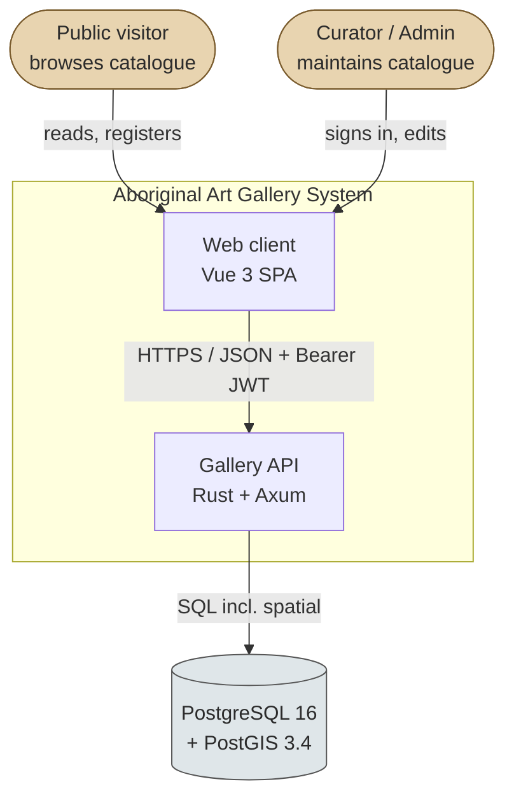
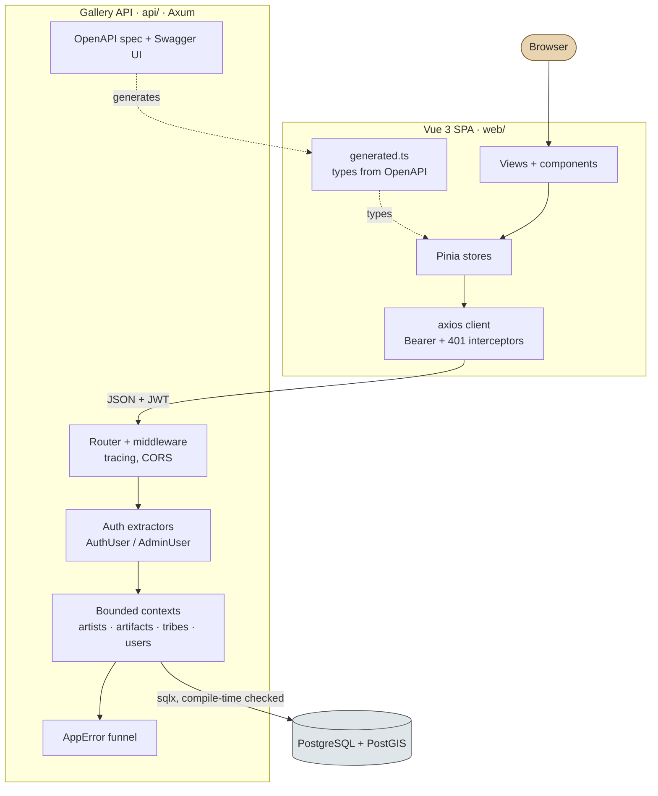
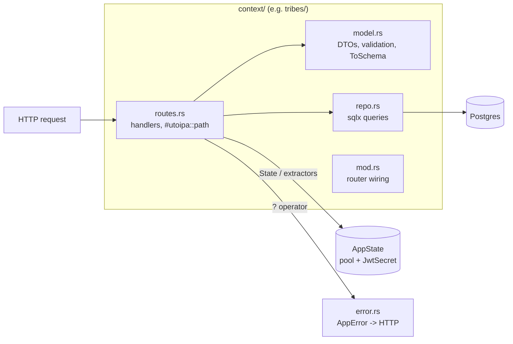
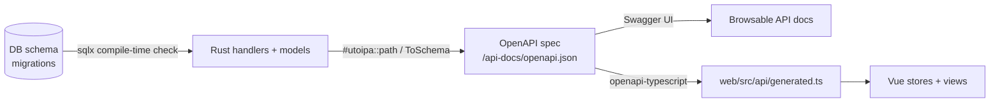

# Architecture - Aboriginal Art Gallery

> C4-style views (Context → Container → Component) plus the auth/request flow
> and the source-of-truth pipeline. Mermaid throughout - renders on GitHub.
> Requirements: [`brd.md`](./brd.md) · Schema: [`erd.md`](./erd.md) ·
> Aggregates: [`aggregate-design-canvases.md`](./aggregate-design-canvases.md).

## C4 Level 1 - System context



The whole system is two deployable units (SPA, API) plus a database. There
are no third-party runtime dependencies - authentication is self-contained
(no external IdP), and there is no message broker.

## C4 Level 2 - Containers



| Container | Tech | Responsibility |
|---|---|---|
| Web SPA | Vue 3, Vite, Pinia, Vue Router, Tailwind v4 | Public browsing + admin CRUD UI. No business rules - mirrors backend authorisation for UX only. |
| Gallery API | Rust, Axum 0.8, sqlx 0.8 | All domain logic, validation, auth, persistence. Sole source of truth. |
| Database | PostgreSQL 16 + PostGIS 3.4 | Persistence + declarative invariants (FK/CHECK/UNIQUE) + spatial queries. |

## C4 Level 3 - API components (one bounded context)

Every bounded context (`artists`, `artifacts`, `tribes`, `users`) follows the
identical four-file shape, so the structure is learnable once and reused:



- **`routes.rs`** - Axum handlers; each annotated with `#[utoipa::path]` so
  the OpenAPI spec is generated from the same source that serves traffic.
  Auth is a *type*: a handler taking `AdminUser` cannot be reached without an
  admin token (it fails extraction → 401/403 before the body runs).
- **`model.rs`** - request/response structs; `validate()` for semantic rules;
  `#[derive(ToSchema)]` for the spec.
- **`repo.rs`** - all SQL, via `sqlx` macros checked against a live database
  at **compile time** - a malformed query or schema drift fails the build.
- **`error.rs`** (shared) - one `AppError`; `?` funnels every failure into a
  uniform `{"error": "..."}` body with the correct status. DB/internal errors
  are logged and flattened to 500 so internals never leak.

## Authentication & request flow

```mermaid
sequenceDiagram
    actor U as Client
    participant A as Axum router
    participant X as Auth extractor
    participant H as Handler
    participant D as Postgres

    U->>A: POST /auth/login {email, password}
    A->>D: find user by email (CITEXT)
    D-->>A: row (Argon2id hash)
    A->>A: verify_password (Argon2id)
    A-->>U: 200 { token (HS256 JWT, 24h), user }

    Note over U: store token; attach Bearer on later calls

    U->>A: PUT /artists/{id}  (Authorization: Bearer …)
    A->>X: extract AdminUser
    X->>X: decode + verify JWT, check role
    alt no/invalid token
        X-->>U: 401
    else valid token, role = User
        X-->>U: 403
    else valid token, role = Admin
        X->>H: AdminUser
        H->>D: UPDATE … (sqlx)
        H-->>U: 200 updated
    end
```

- **Stateless.** The JWT carries `sub`/`email`/`role`/`iat`/`exp`; no server
  session store. `exp` is auto-checked on decode; the secret must be ≥ 32
  bytes (rejected at startup otherwise).
- **Authorisation as types.** `AuthUser` → 401 on failure; `AdminUser` → 403
  for non-admins. Route reachability *is* the access rule - no scattered
  per-handler `if role != …` checks.
- **Uniform failure.** Every error path returns the same JSON envelope and a
  correct status; the SPA's axios interceptor turns any 401 into
  logout-and-redirect.

## Source-of-truth pipeline (no drift by construction)



One direction, each arrow machine-checked:

1. The **database schema** is the root. `sqlx` verifies every query against a
   live DB at compile time - Rust cannot compile against a schema that does
   not exist.
2. The **Rust types + `#[utoipa::path]`** generate the **OpenAPI spec** - the
   docs cannot describe an endpoint the code does not serve.
3. The spec generates **TypeScript types** - the frontend cannot compile
   against a shape the API does not return.

A breaking schema change fails the Rust build; if it compiles, the spec is
correct; regenerate types and any frontend mismatch fails the TS build.
Drift is a compile error, not a runtime surprise (NFR-3).

## Cross-cutting

| Concern | Mechanism |
|---|---|
| Errors | Single `AppError` → `IntoResponse`; uniform `{"error": …}`; 500s logged, never leaked. |
| Logging | `tracing` per-request spans. |
| Config | Env (`.env.example`); `JWT_SECRET` length-checked at startup; `DATABASE_URL` for sqlx/runtime. |
| CORS | Permissive for local demo (documented as a deliberate non-production choice). |
| Testing | `sqlx::test` ephemeral per-test DBs; HTTP-level tests via `tower::oneshot`; full auth/role matrix + spatial queries. |
| Docs | OpenAPI/Swagger at `/docs`; rustdoc on every item; this pack. |
