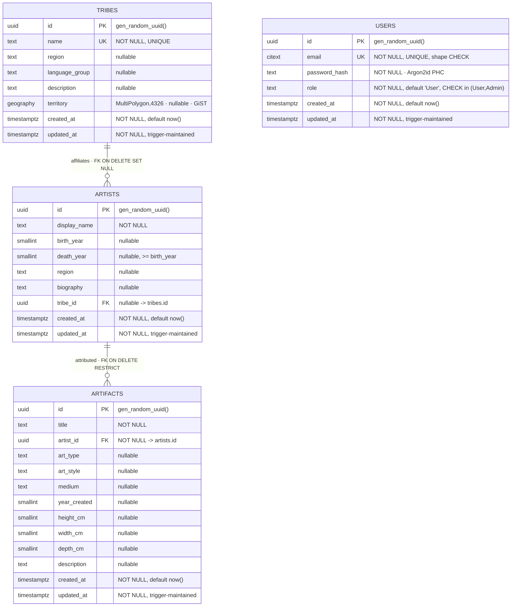

# Database Schema & ERD - Aboriginal Art Gallery

> Generated from the migrations in `api/migrations/` and authoritative against
> them. Renders on GitHub. Domain rationale is in [`brd.md`](./brd.md);
> aggregate invariants in [`aggregate-design-canvases.md`](./aggregate-design-canvases.md).

PostgreSQL 16 + PostGIS 3.4. Four tables across four bounded contexts. The
Users context is intentionally standalone - access control is not coupled to
the catalogue graph.

## Entity-relationship diagram

## Relationships

| From → To | Cardinality | FK policy | Why |
|---|---|---|---|
| `artifacts.artist_id` → `artists.id` | many artifacts → one artist | **ON DELETE RESTRICT** | Attribution is mandatory; an artist with works cannot be deleted (FR-AR-6 / FR-AF-2). Surfaces as 409, not a dangling row. |
| `artists.tribe_id` → `tribes.id` | many artists → one tribe (optional) | **ON DELETE SET NULL** | Affiliation is severable; an artist outlives the tribe *record* disappearing - they become unaffiliated, not deleted (FR-AR-5). |
| `users` | - | - | Standalone. Access control deliberately not joined to the catalogue. |

The two opposing FK policies (RESTRICT vs SET NULL) are a deliberate
demonstration: the same relational tool expresses two different domain rules
depending on whether the link is *protective* or *severable*.

## PostgreSQL-specific features (NFR-1, brief: "complex DB structure")

| Feature | Where | Purpose |
|---|---|---|
| `uuid` PKs via `gen_random_uuid()` | every table | Opaque, non-enumerable identifiers; no sequence coupling. |
| `CITEXT` | `users.email` | Case-insensitive uniqueness/lookup without app-side lowercasing; the `UNIQUE` index doubles as the login index. |
| `geography(MultiPolygon, 4326)` (PostGIS) | `tribes.territory` | WGS-84 spatial data; `ST_Distance`/`ST_DWithin` return real metres. MultiPolygon models non-contiguous Country. |
| **GiST index** `tribes_territory_gix` | `tribes.territory` | Spatial index so "tribes within N km" uses the index instead of an `ST_Distance` table scan. |
| **Functional index** `tribes_name_lower_idx` on `LOWER(name)` | `tribes` | Case-insensitive name lookups stay index-backed. |
| B-tree FK indexes | `artifacts.artist_id`, `artists.tribe_id` | Join/filter performance and fast FK-violation checks. |
| `CHECK` constraints | `artists_lifespan_valid`, `users_role_valid`, `users_email_shape` | Domain invariants enforced in the DB, not just the app. |
| Trigger function `set_updated_at()` | shared, attached per table | One `plpgsql` function maintains every `updated_at`; no app-side timestamp bookkeeping. |
| `INSERT … ON CONFLICT … DO UPDATE` | seed binary (admin upsert) | Idempotent seeding. |
| `ST_AsGeoJSON` / `ST_GeomFromGeoJSON` / `ST_Multi` / `ST_SetSRID` | tribes repo | GeoJSON ↔ geography round-trip at the SQL layer. |
| `ST_DWithin` / `ST_Distance` / `ST_MakePoint` | tribes repo | Spatial "near a point" query, nearest-first. |

## Migrations (ordered)

| Migration | Adds |
|---|---|
| `…_init.sql` | Database baseline. |
| `…_helpers.sql` | `set_updated_at()` trigger function. |
| `…_create_artists.sql` | `artists` + lifespan CHECK + trigger. |
| `…_create_artifacts.sql` | `artifacts` + `artist_id` FK (RESTRICT) + index + trigger. |
| `…_create_tribes.sql` | `tribes` + unique name + functional name index + trigger. |
| `…_add_tribe_id_to_artists.sql` | `artists.tribe_id` FK (SET NULL) + index. |
| `…_create_users.sql` | `citext` extension; `users` + role/email CHECKs + trigger. |
| `…_add_tribe_territory.sql` | `tribes.territory` geography column + GiST index. |

Migrations are forward-only and applied with `sqlx migrate run`. Because
`sqlx` checks queries against a live database **at compile time**, the
migrations must be applied before `cargo build` - see the README.
