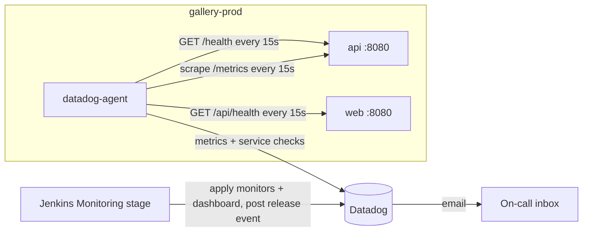

# Monitoring

Production runs a Datadog Agent next to the API, on the free Infrastructure plan.
Everything Datadog knows about the gallery comes from files in this directory, and the Jenkins Monitoring stage applies them on every release.

## What the agent collects

| Source | Check | Data | Billing on the free plan |
| --- | --- | --- | --- |
| `http://api:8080/health` | `http_check` | `http.can_connect` service check, `network.http.response_time` | Integration metric |
| `http://web:8080/api/health` | `http_check` | Same, through the nginx proxy | Integration metric |
| `http://api:8080/metrics` | `openmetrics` | `gallery.http.requests.count`, `gallery.http.request.duration` (distribution), `gallery.http.requests.pending` | Custom metrics |
| Docker socket | `docker` | CPU, memory and restarts for `gallery-prod-*` containers | Integration metric |

The checks are baked into the agent image from `datadog/conf.d/`.
Autodiscovery labels on the API container would stop reporting when the container stops, which turns an outage into "no data" instead of a failing check.

The OpenMetrics check drops the `endpoint` label and keeps only `method` and `status`.
That keeps the custom metric count around ten series.
The API also collapses requests to unknown routes into `endpoint="unmatched"`, so a scanner cannot grow the label set.

## Alert rules

| Monitor | Query | Fires when | Why this threshold |
| --- | --- | --- | --- |
| API is down | `http.can_connect` for `instance:gallery_api`, last 4 runs | 4 consecutive failed probes, about 1 minute | One failed probe is often a restart or a slow query. Four in a row means users are seeing errors. |
| 5xx error rate above 5% | 5xx count / total count over 5 minutes | Warn at 2%, alert at 5% | The API returns 5xx only for database or programming errors, so any sustained rate is a real fault. 5% ignores one bad request during low traffic. |
| Probe latency above 500 ms | average `network.http.response_time` over 5 minutes | Warn at 250 ms, alert at 500 ms | `/health` runs `SELECT 1`, so latency here means the database or the host is saturated. |

Every monitor is tagged `managed-by:gallery-pipeline` and emails `ALERT_EMAIL`.
The "API is down" monitor also alerts on missing data after 2 minutes, which covers the agent itself going away.

## Files

| File | Purpose |
| --- | --- |
| `datadog/Dockerfile` | Agent image with the checks built in, tagged with the release version |
| `datadog/conf.d/` | `http_check` and `openmetrics` configuration |
| `datadog/monitors/*.json` | Monitor definitions in Datadog API format, `__ALERT_EMAIL__` is substituted at apply time |
| `datadog/dashboard.json` | Production dashboard: probe status, monitor summary, request rate, 5xx rate, p95 latency |

Apply by hand with `scripts/datadog-apply.sh` after exporting `DD_API_KEY`, `DD_APP_KEY`, `DD_SITE` and `ALERT_EMAIL`.
